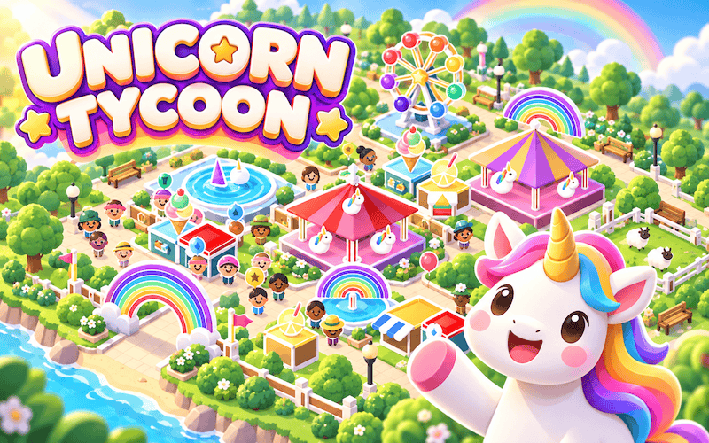
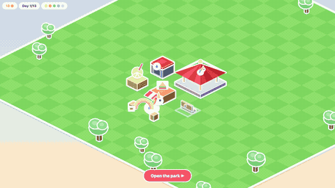
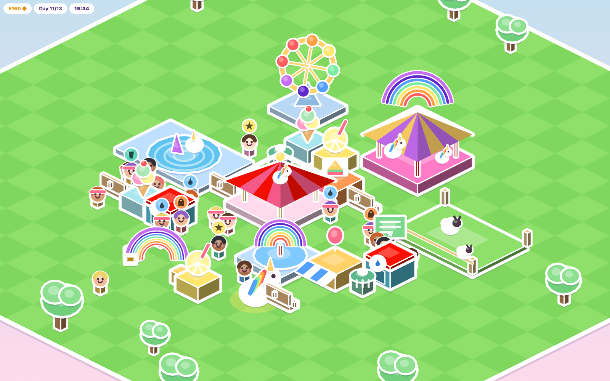

# Unicorn Tycoon

js13kGames 2026 entry. Theme: Unicorns and Rainbows.



An isometric park-management game where you are not the manager. You are the
unicorn. Tap her, pick a building, and she trots across the meadow and raises
it herself. You have thirteen days to turn a field with one carousel into the
happiest park in the world. Then comes the Grand Parade.

The whole game is a single HTML file that zips to under 13 kB. No images, no
audio files, no libraries: every ride, every visitor and every sheep is drawn
with canvas paths, and the soundtrack is synthesised live with the Web Audio
API.

## How to play

Each day has two halves.




In the morning, you build, and the clock does not run: take your time. Tap the
unicorn, choose something from the menu, tap the ground to move the ghost
where you want it, confirm with the tick, and she walks over and builds it.
One building at a time; she is a unicorn, not a construction crew. The
carousel you start with covers fun and nothing else, and your starting credits
are enough to cover the other four needs on the very first morning. On that
first morning the "Open the park" button appears as soon as your first
building is up; after that it is there every morning, and building is
optional. Before you press it, the five dots in the top bar tell you which
needs your park can serve, and each new morning the game names what is still
missing.

From noon, the gates open and the visitors walk in. Building is closed for the
day: what you have is what they get. Your job now is to keep the park running.
Rides and stands wear out with use, and a building that wears out completely
goes out of service and sends visitors away disappointed. One tap on it sends
a rainbow beam from the unicorn that repairs it on the spot, wherever she
happens to be standing, and repairs are free. Tap a building that is still in
good shape and, instead of a repair, you get a label with what it serves and
how worn it is. At seven in the evening, a little over a minute of real time
later, the park closes and you get the report: how your visitors felt about
each of their needs, their mood, and what they paid. It also counts how many
left delighted or angry, and what broke. Overnight every building is back to
new, and a new morning begins.




Controls: drag to pan, pinch or scroll to zoom, tap to act. While the park is
open the unicorn wanders around on her own, and a tap on the ground sends her
wherever you like, purely for the pleasure of it. The music starts on your
first tap, and there is no mute button. It is a phone game first, built for
touch with a layout that respects the notch, and a mouse goes through the same
code.

### What makes visitors pay

Every visitor arrives with five needs: have fun, eat, drink, toilets, rest.
Each one is a gauge that drains at its own pace, and a visitor always heads
for the nearest building that can fill whichever gauge is lowest, with a soft
spot for the rides.

They pay a little at the gate and a little more every time they use something,
but the real money is what they hand over on the way out. That sum is not a
tally of needs served: it is how satisfied they felt, on average, over the
whole visit, and a bad mood takes a cut. A visitor who spent the day trekking
between far-apart buildings had five gauges running low for most of that walk,
and pays badly even though every need was met in the end. A visitor who found
everything in a tight cluster pays well.

Two things in particular get in the way of a happy visitor. When every
building that could serve a need is full, there is no queue: the visitor gives
up, loses some mood and wanders off. And a building that is out of service is
skipped, so the visitors who would have used it walk further and arrive
grumpier, or find nothing at all. The evening report counts the run-ins with
out-of-service buildings; a full one only shows through lower bars and
grumpier visitors. Both answer to the same advice: build more, build closer,
repair faster.

### Reputation

There is no reputation counter in the interface. It is in the world: the
rainbow arch over the entrance gate. It starts with one band lit and lights
up further as your reputation grows, and the evening report puts a number on
it, out of seven.

Reputation is a rolling average of how your recent days went, satisfaction and
mood together. Along with the day count, it decides how many visitors show up
tomorrow: five on the first morning, a couple of dozen by the end if you do
well. A good day brings a bigger crowd, a bigger crowd is harder to keep happy
with the same park, and that loop is the game.

### The buildings

Fourteen types in four tabs: Rides, Zoo, Food and Comfort. Most of them serve
one need and have a capacity and a wear rate. A few do something else.

The Sign makes the two zoo pens standing near it, the Meadow and the Pond,
more satisfying to visit. The Bin takes wear off the food stands and the
fountain around it, and fills up in their place; it still needs emptying. The
Fountain serves a drink like the lemonade stand does, and on top of that calms
every visitor who walks near it, so their mood holds up longer. The Shop
serves no need at all: visitors in a good mood who pass close by buy a
souvenir, extra income for a park that already works, and it wears out with
every sale like a stand does.

Every copy of a building costs more than the last, so a row of identical
benches gets expensive fast and soon costs more than the building your park is
missing. And there is no demolition: what you build stays where you put it.

### The Grand Parade

After the thirteenth evening comes the Grand Parade: your reputation as a row
of rainbow dots, your final treasury, how many buildings your park ended up
with, and one of four verdicts, from "A start. The sheep like you, at least."
to "The happiest park in the world." It also shows the season's three scores:
Happiest Park, Rainbow Tycoon and Crowd Pleaser. A season is played in one
sitting; unlocked achievements are remembered locally.

### Achievements and Wavedash

Ten achievements celebrate construction, maintenance, happy visitors and a
completed season. They display in the game even outside Wavedash. On Wavedash,
the game also records achievements and submits the three leaderboards after
day 13. The host injects its API; no SDK installation or external script is
needed. See [WAVEDASH.md](WAVEDASH.md) for the exact conditions, scoring and
connected test steps, and [achievements.json](achievements.json) for the import.

`wavedash.toml` uploads only `dist/wavedash/`. Run `npm run build` first to
generate its self-contained, uncompressed `index.html` from the source.

## Under the hood

`src/index.html` is the readable, commented source: the CSS, the markup and
the script all live there, and the build reads nothing else. To play while
editing, open it straight in a browser: the game fetches nothing, so `file://`
behaves exactly like a server.

The world is seeded, so every machine starts from the same park and the same
scenery. The music is a lo-fi loop, chords, a bass line and a few random
bells, with the drums only coming in while the park is open. It starts on your
first tap, the way mobile browsers want it.

### Building and testing

```bash
nvm use                          # Node 18.14.1
npm ci                           # install the locked terser + roadroller versions
pip install -r requirements.txt  # zopfli
npm run build                    # -> js13k-game.zip, dist/js13k/, dist/wavedash/
npm test
npm run tune                     # after a big change to the source, see below
```

One command produces both release targets from the same source snapshot:

```text
js13k-game.zip           # contest archive at the project root
dist/
  js13k/
    index.html           # contest page packed with Roadroller
  wavedash/
    index.html           # uncompressed copy of src/index.html
```

The contest target uses Terser, Roadroller and zopfli to stay within 13,312
bytes. The root ZIP contains exactly `dist/js13k/index.html`, named `index.html`
at the archive root. The Wavedash target keeps the readable HTML, CSS and
JavaScript and has no Roadroller decoding step. Only `dist/wavedash/` is uploaded
to Wavedash.
A successful default build recreates `dist/`, removing old generated variants.
Keep source files and media outside this generated directory; `dist/` and ZIP
archives stay ignored by Git. Passing an explicit ZIP output path to `build.sh`
produces only that archive, as tuning needs.

Use the npm scripts rather than `./build.sh` and `./tune.sh` directly: both
look up terser and roadroller on `PATH`, and on a fresh clone those only live
in `node_modules/.bin`, which `npm run` puts on `PATH` for you.

The tests boot the game in a Node `vm` sandbox with a stubbed DOM and canvas.
One suite draws every building type and plays three days with an automatic
player that fills last night's biggest gap and repairs anything about to
break. The other walks the interface cycle, title screen, first build,
opening, the repair hint, the evening report, day two, through the DOM
wherever the DOM can do it. A third suite verifies all achievement conditions,
a complete 13-day season and the Wavedash API contracts against both source
and the production Terser options, including property mangling. It covers
delayed statistics, duplicate events, blocked storage and failed API calls.
The test verifies that the ZIP's page matches `dist/js13k/index.html` and that
the Wavedash page matches the source. Both the extracted ZIP and Wavedash page
are checked in Chromium and Firefox with
`python3 test/browser.py` (requires Playwright). This builds a Bench through
the interface, checks the achievement banner and local record, plays through
day one, verifies the resized mobile canvas is rendered and captures its layout.

Install the optional browser-test dependencies separately:

```bash
python3 -m pip install playwright
python3 -m playwright install chromium firefox
python3 test/browser.py
```

### Fitting in 13 kB

The chain that turns the readable source into a 13 kB zip:

```text
src/index.html
  -> tools/inline.py   CSS and DOM folded into the JS
  -> tools/minify.cjs  Terser: minify, mangle top-level names and private properties
  -> roadroller        packer, parameters frozen
  -> dist/js13k/index.html
  -> tools/zipit.py    hand-built ZIP container with a zopfli deflate
  -> js13k-game.zip    archive at the project root
```

Roadroller is a packer written for js13k: it turns the minified script into a
self-extracting string, compressed far more tightly than a zip could manage,
at the cost of a short decode when the page loads. Measured on the current
build:

| Stage | Size |
| --- | --- |
| After terser | 42 541 B |
| After roadroller | 17 383 B |
| Zipped | 13 255 B of 13 312 (57 B remaining) |

Three choices in that chain are worth knowing about.

The CSS and the DOM are injected from the JS rather than left as markup next
to the script. That puts them inside roadroller's stream, whose model
compresses them far better than the zip's deflate would. The shell around the
script, doctype, meta tags and title, is written by `build.sh` itself.

Roadroller's parameters are frozen in `build.sh`. Its default search is random
and lands a dozen or so bytes apart from one run to the next, which is not a
good property when the margin is measured in bytes. Replaying a fixed set
keeps the compression settings stable. With the same source and tool versions,
the build is deterministic; measure the ZIP again after any change.
After any notable change to the source, `npm run tune` re-rolls the search
eight times, carries each draw through to a real zip, and prints the parameter
line to paste back.

The ZIP is assembled by hand. Python's `zipfile` cannot use zopfli, so
`tools/zipit.py` writes the three records of the format itself and drops in a
zopfli deflate stream. It exits non-zero when the archive goes over budget, so
a failed build is loud.

Short building identifiers are generated only during the build. Terser renames
an explicit list of private game properties, preserving browser and Wavedash
API names and boolean arguments. An oversized ZIP fails before replacing the
last valid release.

## Media

`media/` holds the cover and thumbnail for the submission form, a few
screenshots, and the gameplay recordings. None of it is part of the zip.

The recordings are not screen captures: `tools/record.mjs` drives the real
game in a headless Chromium with a fixed timestep and an automatic player,
then ffmpeg assembles the frames, so two runs of the same command give the
same game, give or take the moment a hint fades out. The commands behind each
file are in the script's header. The screenshots come from
`tools/capture-park.py`, which stages a populated park in the real engine, and
`tools/prepare-artwork.sh` resizes original artwork under the form's limits.
It requires `media/artwork/originals/cover.png` and
`media/artwork/originals/thumbnail.png`, which are not included in this checkout;
the final submission PNGs are already provided. These tools need Playwright
and a few system utilities (ffmpeg,
ImageMagick, pngquant, advpng). Playwright is deliberately kept out of
`devDependencies`: the build never needs it, and `npm install` stays limited
to the two packages the zip depends on.

## Licence

MIT.
